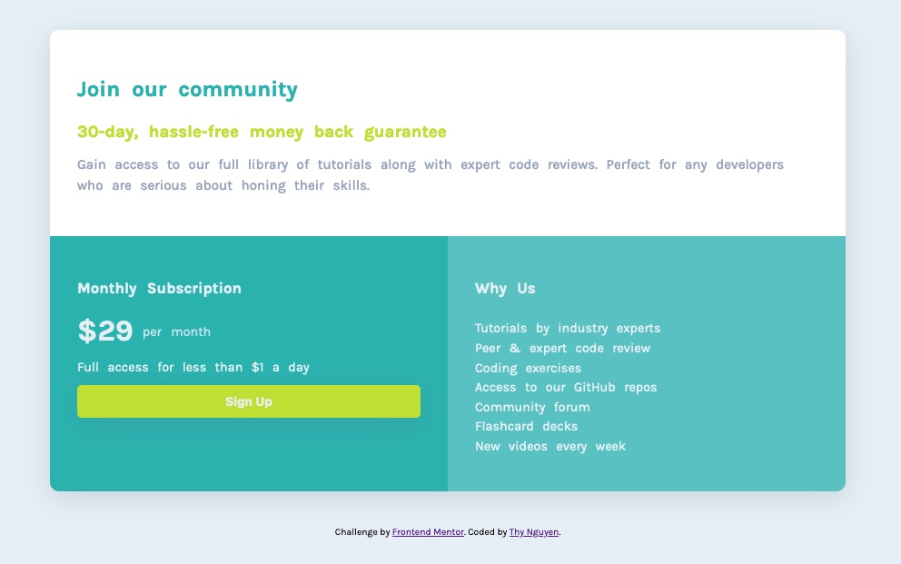
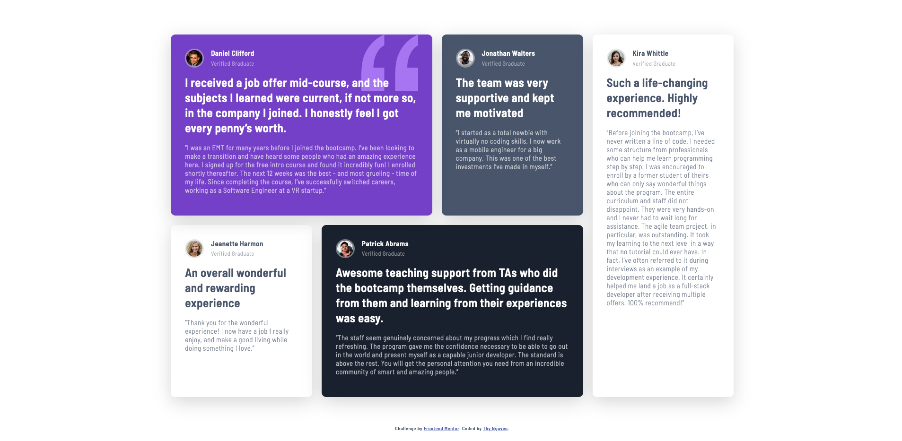
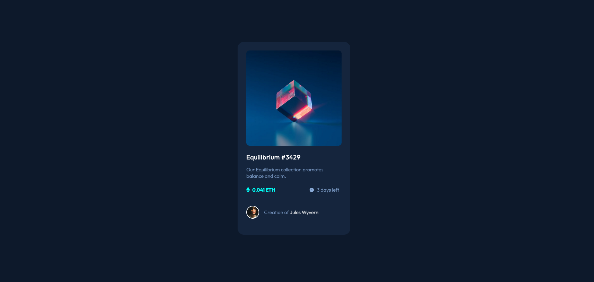

# Introduction
This repository contains mostly static webpages that I built without or with minimal JavaScript. My main focus here is to improve my HTML and CSS skills through the projects I've completed. This repository is a work in progress as I'm working through different front-end projects.

Below are examples of some projects that I have done:
* [Introduction](#introduction)
  * [Single price grid](#single-price-grid)
  * [Testimonials grid section](#testimonials-grid-section)
  * [Product preview card component](#product-preview-card-component)
  * [Interactive rating component](#interactive-rating-component)
  * [Base Apparel coming soon page](#base-apparel-coming-soon-page)
  * [Stats preview card](#stats-preview-card)
  * [Order summary component](#order-summary-component)
  * [NFT preview card](#nft-preview-card)
  * [3-column preview card](#3-column-preview-card)
  * [Social proof section](#social-proof-section)
  * [Four card feature section](#four-card-feature-section)
  * [Huddle landing page](#huddle-landing-page)

---

## Single price grid

- ⚙️ Built with HTML and CSS
- 🔗 Live demo: [Link here](https://thynguyenxo.github.io/frontend-portfolio/single-price-grid/index.html)

## Testimonials grid section

- ⚙️ Built with HTML and CSS
- 🔗 Live demo: [Link here](https://thynguyenxo.github.io/frontend-portfolio/testimonials-grid/index.html)

## Product preview card component

- ⚙️ Built with HTML, CSS, and JavaScript
- 🔗 Live demo: [Link here](https://thynguyenxo.github.io/frontend-portfolio/product-preview-card-component/index.html)

This challenge does not require implementing JavaScript but I went a step further to add a modal indicating to users that the product has been added to the cart when clicking on the 'Add to Cart' button. 

## Interactive rating component

- ⚙️ Built with HTML, CSS, and JavaScript
- 🔗 Live demo: [Link here](https://thynguyenxo.github.io/frontend-portfolio/interactive-rating/index.html)

## Base Apparel coming soon page

- ⚙️ Built with HTML, CSS, and JavaScript
- 🔗 Live demo: [Link here](https://thynguyenxo.github.io/frontend-portfolio/base-apparel-coming-soon/index.html)

## Stats preview card

- ⚙️ Built with HTML and CSS
- 🔗 Live demo: [Link here](https://thynguyenxo.github.io/frontend-portfolio/stats-preview-card-component/index.html)

## Order summary component

- ⚙️ Built with HTML, CSS, and JavaScript
- 🔗 Live demo: [Link here](https://thynguyenxo.github.io/frontend-portfolio/order-summary-component/index.html)

## NFT preview card

- ⚙️ Built with HTML and CSS
- 🔗 Live demo: [Link here](https://thynguyenxo.github.io/frontend-portfolio/nft-preview-card-component/index.html)

## 3-column preview card

- ⚙️ Built with HTML and CSS
- 🔗 Live demo: [Link here](https://thynguyenxo.github.io/frontend-portfolio/3-column-preview-card-component/index.html)

## Social proof section

- ⚙️ Built with HTML and CSS
- 🔗 Live demo: [Link here](https://thynguyenxo.github.io/frontend-portfolio/social-proof-section/index.html)

## Four card feature section

- ⚙️ Built with HTML and CSS
- 🔗 Live demo: [Link here](https://thynguyenxo.github.io/frontend-portfolio/four-card-feature-section/index.html)

## Huddle landing page

- ⚙️ Built with HTML and CSS
- 🔗 Live demo: [Link here](https://thynguyenxo.github.io/frontend-portfolio/huddle-landing-page-with-single-introductory-section/index.html)

